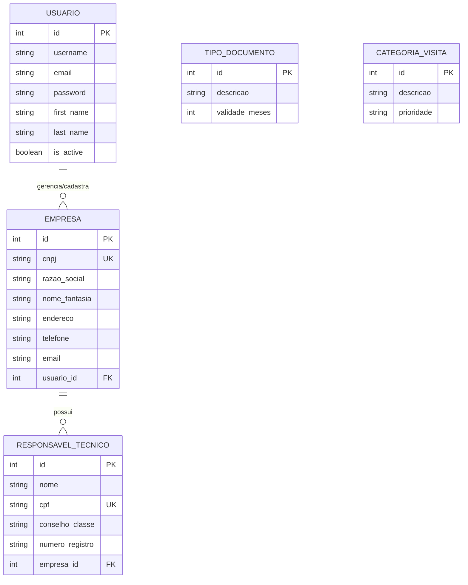

# Entidade e Relacionamento - Vigilância Sanitária

Este documento detalha as 5 entidades principais solicitadas (Usuário, Empresa, Responsável Técnico, Tipo de Documento e Categoria de Visita) e seus respectivos relacionamentos.

## 1. Dicionário de Dados

### 1.1 Usuario
Representa os usuários do sistema (podem ser fiscais, administradores ou os representantes legais dos estabelecimentos).
* **id** (PK): Identificador único.
* **username**: Nome de usuário para login.
* **email**: Endereço de e-mail.
* **password**: Senha criptografada.
* **first_name**: Primeiro nome.
* **last_name**: Sobrenome.
* **is_active**: Status indicando se a conta está ativa.

### 1.2 Empresa (Estabelecimento)
Representa os estabelecimentos comerciais sujeitos às normativas e inspeções da vigilância sanitária.
* **id** (PK): Identificador único.
* **cnpj**: Cadastro Nacional de Pessoa Jurídica (Chave Única).
* **razao_social**: Nome oficial registrado na receita.
* **nome_fantasia**: Nome comercial do estabelecimento.
* **endereco**: Endereço completo.
* **telefone**: Número de contato.
* **email**: E-mail corporativo de contato.
* **usuario_id** (FK): Referência ao `Usuario` representante (dono da conta que gerencia a empresa).

### 1.3 ResponsavelTecnico
Profissional com habilitação legal responsável pelas atividades técnicas da empresa (ex: Farmacêutico, Engenheiro de Alimentos, Médico).
* **id** (PK): Identificador único.
* **nome**: Nome completo do profissional.
* **cpf**: Cadastro de Pessoa Física (Chave Única).
* **conselho_classe**: Sigla do conselho regulador (Ex: CRF, CRM, CRQ).
* **numero_registro**: Número de inscrição ativo no conselho.
* **empresa_id** (FK): Referência à `Empresa` na qual ele atua.

### 1.4 TipoDocumento
Entidade de domínio (lookup) que cataloga os diferentes tipos de documentos processados pelo órgão.
* **id** (PK): Identificador único.
* **descricao**: Título do tipo de documento (Ex: "Alvará Sanitário", "Laudo Técnico", "Plano de Gerenciamento de Resíduos").
* **validade_meses**: Tempo padrão (em meses) que o documento permanece válido após emissão (Pode ser nulo caso não vença).

### 1.5 CategoriaVisita
Entidade de domínio (lookup) que classifica as motivações pelas quais um fiscal vai a um estabelecimento.
* **id** (PK): Identificador único.
* **descricao**: Nome da categoria (Ex: "Inspeção de Rotina", "Atendimento a Denúncia", "Renovação de Alvará").
* **prioridade**: Grau de urgência/criticidade atrelado (Ex: Baixa, Média, Alta).

---

## 2. Relacionamentos

1. **Usuario -> Empresa (1:N)**:
   * Um Usuário (representante) pode ter ou gerenciar várias Empresas sob sua responsabilidade no sistema.
   * Cada Empresa pertence a um Usuário gestor.

2. **Empresa -> ResponsavelTecnico (1:N)**:
   * Uma Empresa pode registrar diversos Responsáveis Técnicos (dependendo dos serviços prestados).
   * Cada Responsável Técnico, nesta modelagem simples, é alocado em uma respectiva Empresa.

> **Nota:** As entidades `TipoDocumento` e `CategoriaVisita` atuarão como chaves estrangeiras (FK) futuras para as tabelas transacionais de `Documento` e `Visita` (que consumirão esses cadastros de domínio).

---

## 3. Diagrama Entidade-Relacionamento (ER)

Abaixo o diagrama em formato Mermaid para fácil visualização:

